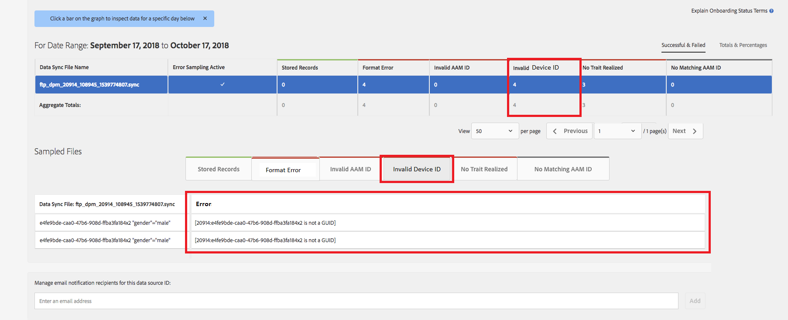

# 전역 장치 ID 유효성 검사 {#global-device-id-validation}

장치 광고 식별자(예: iDFA, GAID, Roku ID)에는 디지털 광고 에코시스템에서 사용할 수 있도록 하기 위해 충족해야 하는 형식 지정 표준이 있습니다. 이제 고객 및 파트너는 ID의 올바른 형식 지정 여부에 대한 알림을 받지 않고도 원하는 형식의 ID를 글로벌 [!UICONTROL data sources]에 업로드할 수 있습니다. 이 기능은 적절한 서식 지정을 위해 전역 [!UICONTROL data sources]에 전송된 장치 ID의 유효성 검사를 도입하며 ID의 형식이 잘못된 경우 오류 메시지를 제공합니다. 시작 시 [!DNL iDFA], [!DNL Google Advertising] 및 [!DNL Roku IDs]에 대한 유효성 검사를 지원합니다.

## 형식 표준 개요 {#overview-of-format-standards}

다음은 AAM에서 현재 인식하여 지원하는 전역 장치 광고 ID 풀입니다. 이러한 데이터는 이러한 플랫폼의 사용자와 연결된 데이터로 작동하는 고객 또는 데이터 파트너가 사용할 수 있는 공유 [!UICONTROL Data Sources]으로 구현됩니다.

<table>
  <tr>
   <td>플랫폼 </td>
   <td>AAM 데이터 소스 ID </td>
   <td>ID 형식 </td>
   <td>AAM PID </td>
   <td>참고 </td>
  </tr>
  <tr>
   <td>Google Android(GAID)</td>
   <td>20914년</td>
   <td>일반적으로 8-4-4-4-12<em>예, 97987bca-ae59-4c7d-94ba-ee4f19ab8c21  </em> </td>
   <td>1352년</td>
   <td>이 ID는 원시/해시됨/변경되지 않은 양식 참조 - <a href="https://play.google.com/about/monetization-ads/ads/ad-id/">https://play.google.com/about/monetization-ads/ads/ad-id/</a></td>
  </tr>
  <tr>
   <td>Apple iOS(IDFA)</td>
   <td>20915년</td>
   <td>32개의 16진수 숫자(일반적으로 8-4-4-4-12 <em>예, 6D92078A-8246-4BA4-AE5B-76104861E7DC  </em>) </td>
   <td>3560년</td>
   <td>이 ID는 원시/해시됨/변경되지 않은 양식 참조 - <a href="https://support.apple.com/en-us/HT205223">https://support.apple.com/en-us/HT205223</a></td>
  </tr>
  <tr>
   <td>로쿠(RIDA)</td>
   <td>121963</td>
   <td>일반적으로 8-4-4-4-12 <em>예,<em> </em>fcb2a29c-315a-5e6b-bcfd-d889ba19aada</em></td>
   <td>11536년</td>
   <td>이 ID는 원시/해시됨/변경되지 않은 양식 참조 - <a href="https://sdkdocs.roku.com/display/sdkdoc/Roku+Advertising+Framework">https://sdkdocs.roku.com/display/sdkdoc/Roku+Advertising+Framework</a> </td>
  </tr>
  <tr>
   <td>Microsoft 광고 ID(가정부)</td>
   <td>389146</td>
   <td>영숫자 문자열</td>
   <td>14593년</td>
   <td>이 ID는 원시/해시됨/변경되지 않은 양식 참조 - <a href="https://docs.microsoft.com/en-us/uwp/api/windows.system.userprofile.advertisingmanager.advertisingid">https://docs.microsoft.com/en-us/uwp/api/windows.system.userprofile.advertisingmanager.advertisingid</a> <a href="https://msdn.microsoft.com/en-us/library/windows/apps/windows.system.userprofile.advertisingmanager.advertisingid.aspx">https://msdn.microsoft.com/en-us/library/windows/apps/windows.system.userprofile.advertisingmanager.advertisingid.aspx</a></td>
  </tr>
  <tr>
   <td>삼성 DUID</td>
   <td>404660</td>
   <td>영숫자 문자열 예, 7XCBNROQJQPYW</td>
   <td>15950년</td>
   <td>이 ID는 원시/해시됨/변경되지 않은 양식 참조 - <a href="https://developer.samsung.com/tv/develop/api-references/samsung-product-api-references/productinfo-api">https://developer.samsung.com/tv/develop/api-references/samsung-product-api-references/productinfo-api</a> </td>
  </tr>
</table>

## 앱 {#setting-an-advertising-identifier-in-the-app}에서 광고 식별자 설정

앱에서 광고주 ID를 설정하는 것은 두 단계로, 먼저 광고주 ID를 검색한 다음 Experience Cloud에 보내는 것입니다. 이러한 단계를 수행하려면 아래 링크를 참조하십시오.

1. ID 검색
   1. [!DNL Apple] 여기에 관련 정보가  [!DNL advertising ID] 있습니다 .
   1. [!DNL Android] 개발자에 대한 [!DNL advertiser ID] 설정에 대한 일부 정보는 [HERE](http://www.androiddocs.com/google/play-services/id.html)을 참조하십시오.
1. SDK의 [!DNL setAdvertisingIdentifier] 메서드를 사용하여 Experience Cloud으로 보내기
   1. `setAdvertisingIdentifier` 사용에 대한 정보는 [!DNL iOS] 및 [!DNL Android]에 대한 [설명서](https://aep-sdks.gitbook.io/docs/using-mobile-extensions/mobile-core/identity/identity-api-reference#set-an-advertising-identifier)에 있습니다.

`// iOS (Swift) example for using setAdvertisingIdentifier:`
`ACPCore.setAdvertisingIdentifier([AdvertisingId]) // ...where [AdvertisingId] is replaced by the actual advertising ID`

## 잘못된 ID {#dcs-error-messaging-for-incorrect-ids}에 대한 DCS 오류 메시지

잘못된 글로벌 장치 ID(IDFA, GAID 등)가 실시간으로 Audience Manager에 제출되면 히트에 대해 오류 코드가 반환됩니다. 다음은 ID가 [!DNL Apple IDFA]으로 전송되어 대문자만 포함해야 하며 ID에는 소문자 &#39;x&#39;가 더 작기 때문에 반환되는 오류의 예입니다.

오류 코드 목록은 [설명서](https://experienceleague.adobe.com/docs/audience-manager/user-guide/api-and-sdk-code/dcs/dcs-api-reference/dcs-error-codes.html?lang=en#api-and-sdk-code)를 참조하십시오.

## 온보딩 글로벌 장치 ID {#onboarding-global-device-ids}

글로벌 장치 ID의 실시간 제출 외에도 ID에 대해 &quot;[!DNL onboard]&quot;(업로드) 데이터를 제출할 수도 있습니다. 이 프로세스는 고객 ID에 대해 온보딩 데이터를 수행하는 경우와 동일하지만(일반적으로 키/값 쌍을 통해) 적절한 데이터 소스 ID를 사용하면 데이터가 글로벌 장치 ID에 할당되도록 합니다. 온보딩 프로세스에 대한 설명서는 [설명서](https://experienceleague.adobe.com/docs/audience-manager/user-guide/implementation-integration-guides/sending-audience-data/batch-data-transfer-process/batch-data-transfer-overview.html?lang=en#implementation-integration-guides)에서 찾을 수 있습니다. 사용 중인 플랫폼에 따라 글로벌 [!UICONTROL data source] ID를 사용해야 합니다.

온보딩 프로세스를 통해 잘못된 글로벌 장치 ID를 제출하면 오류가 [[!DNL Onboarding Status Report]](https://experienceleague.adobe.com/docs/audience-manager/user-guide/reporting/onboarding-status-report.html?lang=en#reporting)에 표시됩니다.

다음은 해당 보고서를 통해 발생할 수 있는 오류의 예입니다.

