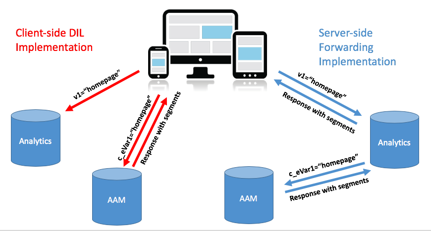
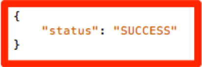

# 사이트의 AAM 구현을 [!DNL Client-Side] DIL에서 [!DNL Server-Side Forwarding]로 마이그레이션 {#migrating-your-site-s-aam-implementation-from-client-side-dil-to-server-side-forwarding}

이 자습서는 Adobe Audience Manager(AAM)과 Adobe Analytics이 모두 있고 현재 &quot;DIL&quot;([!DNL Data Integration Library]) 코드를 사용하여 페이지에서 AAM으로 히트를 전송하고 있으며, 히트를 페이지의 히트도 Adobe Analytics으로 보내는 경우에 적용됩니다. 이 두 가지 솔루션을 모두 사용할 수 있으며, 둘 다 Adobe Experience Cloud의 일부이므로, [!DNL client-side] 코드가 Audience Manager에서 AAM으로 추가 히트를 보내는 대신 [!DNL Analytics] 데이터 수집 서버에서 실시간으로 사이트 분석 데이터를 전송할 수 있는 &quot;[!DNL Server-Side Forwarding] (SSF)&quot;를 설정하는 우수 사례를 따를 수 있습니다. 이 자습서에서는 이전 &quot;[!DNL Client-Side DIL]&quot; 구현에서 최신 &quot;[!DNL Server-Side forwarding]&quot; 메서드로 전환하는 단계를 설명합니다.

## [!DNL Client-Side] (DIL)과  [!DNL Server-Side] {#client-side-dil-vs-server-side}

Adobe Analytics 데이터를 AAM에 가져오는 두 가지 방법을 비교하고 비교할 때, 먼저 다음 이미지에서 차이점을 시각화하는 것이 도움이 될 수 있습니다.

### [!DNL Client-side] DIL 구현 {#client-side-dil-implementation}

이 방법을 사용하여 Adobe Analytics 데이터를 AAM에 가져오는 경우 웹 페이지에서 두 개의 히트가 있음을 의미합니다. [!DNL Analytics]으로 이동하고, 또 하나는 AAM으로 이동합니다([!DNL Analytics] 데이터를 웹 페이지에서 복사한 후). [!UICONTROL Segments] AAM에서 페이지로 반환되며, 여기에서 개인화에 사용할 수 있습니다. 이는 &quot;이전&quot; 구현으로 간주되며 더 이상 권장되지 않습니다.

이 방법이 우수 사례를 따르지 않는다는 사실 외에 이 메서드를 사용할 때의 단점은 다음과 같습니다.

* 한 번의 히트가 아니라 페이지에서 오는 두 개의 히트입니다
* [!UICONTROL Server-Side Forwarding] 는 AAM 대상을 실시간으로 공유하는 데  [!DNL Analytics]필요하므로  [!DNL Client-side] 구현에서 이 기능(및 향후의 다른 기능)을 허용하지 않습니다

AAM 구현의 [!UICONTROL Server-Side Forwarding] 메서드로 이동하는 것이 좋습니다.

### [!UICONTROL Server-Side Forwarding] 구현 {#server-side-forwarding-implementation}

위의 이미지에 표시된 대로, 히트는 웹 페이지에서 Adobe Analytics으로 가져옵니다. [!DNL Analytics] 그런 다음 이 데이터를 실시간으로 AAM에 전달하며 방문자는 히트가 페이지 [!UICONTROL traits] 에서 바로 온 것처럼 AAM 및  [!UICONTROL segments]로 평가됩니다.

[!UICONTROL Segments] 는 동일한 실시간 히트에서  [!DNL Analytics]로 반환되고, 이 히트는 개인화 등을 위해 웹 페이지에 응답을 전달합니다.

서버측 전달로 이동하는 데 시간이 따르는 단점이 없습니다. Audience Manager과 [!DNL Analytics] 모두에 이 구현 방법을 사용하는 것이 좋습니다.

## 두 가지 주요 작업이 있습니다. {#you-have-two-main-tasks}

이 페이지에는 많은 정보가 있으며, 물론 이 모든 것이 중요합니다. 하지만 **모두 다음 두 가지 주요 항목으로 요약됩니다.**

1. 코드를 [!DNL Client-Side] DIL 코드에서 [!UICONTROL Server-Side Forwarding] 코드로 변경합니다
1. [!DNL Analytics] [!DNL Admin Console]에서 스위치를 전환하여 데이터의 실제 전달을 시작합니다( [!UICONTROL report suite]에 따라)

이 두 가지 중 하나를 건너뛰면 SSF가 제대로 작동하지 않습니다. 설정에 대해 이러한 두 단계를 올바르게 수행하는 데 도움이 되는 단계 및 추가 데이터가 이 문서에 추가되었습니다.

## 구현 옵션 {#implementation-options}

[!DNL client-side]에서 [!DNL server-side](으)로 이동하면 수행할 작업 중 하나가 코드를 새 [!UICONTROL Server-Side Forwarding] 코드로 변경하고 있습니다. 이 작업은 다음 옵션 중 하나를 사용하여 수행됩니다.

* Adobe Experience Platform Launch - 웹 속성에 대해 권장되는 구현 옵션입니다. [!DNL Launch] 이 모든 어려운 작업을 수행했기 때문에 이 작업이 매우 쉬운 작업임을 알 수 있을 것입니다.
* 페이지에서 - Launch를 사용하지 않는 경우(아직) 새 SSF 코드를 [!DNL appMeasurement.js] 파일 내의 `doPlugins` 함수에 직접 배치할 수도 있습니다
* 다른 태그 관리자 - 다른 태그 관리자가 [!DNL AppMeasurement] 코드를 저장하는 곳마다 `doPlugins`에 SSF 코드를 넣듯이 이전(페이지에서) 옵션처럼 처리할 수 있습니다

아래의 코드 업데이트 섹션에서 각 항목을 살펴보겠습니다.

## 구현 절차 {#implementation-steps}

### 0단계: 전제 조건: Experience Cloud ID 서비스(ECID) {#step-prerequisite-experience-cloud-id-service-ecid}

[!UICONTROL Server-Side Forwarding](으)로 이동하기 위한 기본 전제 조건은 Experience Cloud ID 서비스가 구현된 상태여야 합니다. 이 작업은 Experience Platform Launch을 사용하는 경우 가장 쉽게 수행합니다. 이 경우 ECID 확장을 설치하면 나머지 작업을 수행합니다.

Adobe이 아닌 TMS를 사용하거나 TMS가 없는 경우 ECID를 구현하여 다른 Adobe 솔루션 전에 **을 실행하십시오.** 자세한 내용은 [ECID 설명서](https://marketing.adobe.com/resources/help/ko_KR/mcvid/)를 참조하십시오. 유일한 다른 전제 조건은 코드 버전에 대한 것이므로 다음 단계에서 최신 버전의 코드를 적용하면 됩니다.

>[!NOTE]
>
>구현하기 전에 이 전체 문서를 읽어 보십시오. 아래의 &quot;시간&quot; 섹션에는 ECID(아직 구현되지 않은 경우)를 포함하여 각 조각을 구현해야 하는 *에 대한 중요한 정보가 있습니다.*

### 1단계: DIL 코드의 현재 사용된 옵션 기록 {#step-record-currently-used-options-from-dil-code}

[!DNL Client-Side] DIL 코드에서 [!UICONTROL Server-Side Forwarding]로 이동할 준비가 되면 첫 번째 단계는 사용자 지정 설정 및 AAM으로 전송된 데이터를 포함하여 DIL 코드로 수행하는 모든 것을 식별하는 것입니다. 주목할 만한 사항은 다음과 같습니다.

* 일반 [!DNL Analytics] 변수([!DNL siteCatalyst.init] DIL 모듈 사용) - 이 변수에 대해서는 걱정할 필요가 없습니다. 이 변수는 일반 [!DNL Analytics] 변수를 보내기만 하는 작업이며, SSF가 활성화되어 있기 때문에 발생합니다.
* Partner Subdomain - DIL.create 함수에서 `partner` 매개 변수를 참고하십시오. 이를 &quot;파트너 하위 도메인&quot; 또는 &quot;파트너 ID&quot;라고도 하며 새 SSF 코드를 배치할 때 필요합니다.
* [!DNL Visitor Service Namespace] - &quot;[!DNL Org ID]&quot; 또는 &quot;[!DNL IMS Org ID]&quot;라고도 하는 경우 새 SSF 코드를 설정할 때도 필요합니다. 메모를 해 보세요.
* containerNSID, uuidCookie 및 기타 고급 옵션 - SSF 코드에서도 설정할 수 있도록 사용 중인 모든 추가 고급 옵션을 주목하십시오.
* 추가 페이지 변수 - 다른 변수가 페이지에서 AAM으로 전송되는 경우(siteCatalyst.init에서 처리하는 일반적인 [!DNL Analytics] 변수 외에도) SSF(스포일러 경고)를 통해 전송할 수 있도록 메모를 해야 합니다. [!DNL contextData] 변수를 통해)에 액세스할 수 있습니다.

### 2단계: 코드 업데이트 {#step-updating-the-code}

위의 &quot;구현 옵션&quot;이라는 섹션에서 [!UICONTROL Server-Side Forwarding]을 구현하는 방법/위치에 대한 여러 옵션이 제공됩니다. 이 섹션이 유효하려면 이러한 섹션으로 분류해야 합니다(두 개가 결합되어 있음). 필요에 대해 가장 잘 설명하는 이 섹션의 메서드로 이동합니다.

#### Adobe Experience Platform Launch {#launch-by-adobe}

구현 옵션을 [!DNL Client-Side] DIL 코드에서 Experience Platform Launch의 [!UICONTROL Server-Side Forwarding]로 이동하는 방법에 대해 알아보려면 아래 비디오를 시청하십시오.

>[!VIDEO](https://video.tv.adobe.com/v/26310/?quality=12)

#### &quot;On the Page&quot; 또는 Non-Adobe Tag Manager {#on-the-page-or-non-adobe-tag-manager}

파일 또는 비Adobe 태그 관리 시스템에 있는 [!DNL Client-Side] DIL 코드에서 [!DNL AppMeasurement] 코드의 [!UICONTROL Server-Side Forwarding]로 구현 옵션을 이동하는 방법에 대해 알아보려면 아래 비디오를 시청하십시오.

>[!VIDEO](https://video.tv.adobe.com/v/26312/?quality=12)

### 3단계: 전달 활성화 ([!UICONTROL Report Suite]당) {#step-enabling-the-forwarding-per-report-suite}

지금까지 이 자습서에서는 [!DNL Client-Side DIL] 코드에서 [!UICONTROL Server-Side Forwarding](으)로 코드를 전환하는 데 모든 시간을 사용했습니다. 그게 더 어려운 부분이라 괜찮습니다 이 섹션은 매우 간단하지만 코드를 업데이트하는 것만큼 중요합니다. 이 비디오에서는 데이터를 Analytics에서 Audience Manager으로 실제로 전달할 수 있는 스위치를 뒤집는 방법을 확인할 수 있습니다.

>[!VIDEO](https://video.tv.adobe.com/v/26355/?quality-12)

**참고:**  비디오에 명시된 대로 Experience Cloud 백엔드에서 전달을 완전히 구현하려면 최대 4시간이 소요됩니다.

## 타이밍 {#timing}

미리 알림으로, [!DNL Client-Side DIL]에서 [!UICONTROL Server-Side Forwarding](으)로 이동할 두 가지 주요 작업이 있습니다.

1. 코드 업데이트
1. [!DNL Analytics] [!DNL Admin Console]에서 스위치 뒤집기

하지만 문제는, 어느 것을 먼저 하느냐입니다. 중요한 건가요? 네, 죄송합니다. 두 가지 질문이었습니다. 하지만 대답은... 상황에 따라 다르며, 그렇다. ** 막연한 게 어때요? 그것을 분류합시다. 그러나 먼저 많은 사이트가 있는 대규모 조직일 경우 발생할 수 있는 추가 질문: 모든 일을 한꺼번에 해야 하나요? 그건 좀 쉬워요 아니 한 조각씩 할 수 있어요 :)

### 좀 더 깊이 들여다보기 {#a-little-deeper-dive}

타이밍과 순서가 중요한 이유는 다음과 같은 몇 가지 기술적 사실들로 요약할 수 있는 전달 *실제로 작동하는 방식 때문입니다.

* ECID(Experience Cloud ID 서비스)가 구현되어 있고 [!DNL Analytics] [!DNL Admin Console](&quot;스위치&quot;)의 스위치가 켜져 있는 경우, 코드를 아직 업데이트하지 않았더라도 데이터가 [!DNL Analytics]에서 AAM으로 전달됩니다.
* ECID를 구현하지 않은 경우, 스위치가 켜져 있고 SSF 코드가 있더라도 데이터가 전달되지 않습니다.
* SSF 코드([!DNL Launch]에 있든 페이지에 있든)는 실제로 응답을 처리하며 마이그레이션을 완료하는 데 반드시 필요합니다.
* SSF 스위치는 [!UICONTROL Report Suite]에 의해 활성화되지만, [!DNL Launch]의 속성에 의해 코드가 처리되거나 [!DNL Launch]를 사용하지 않는 경우에는 [!DNL AppMeasurement] 파일에 의해 처리된다는 점을 기억하십시오

### 우수 사례 {#best-practices}

다음은 이러한 기술 세부 사항을 기반으로 &quot;작업 시기&quot;에 대한 권장 사항입니다.

#### ECID가 아직 구현되지 않은 경우 {#if-you-do-not-have-ecid-yet-implemented}

1. SSF에 사용할 각 [!UICONTROL report suite]에 대해 [!DNL Analytics]에서 스위치를 뒤집습니다.

   1. ECID가 없으므로 전달이 아직 시작되지 않습니다

1. 사이트별로 코드를 [!DNL Client-Side DIL]에서 SSF로 업데이트합니다(위의 다른 섹션에서 설명한 대로 [!DNL Launch]에 있거나 페이지에 있을 수 있음)

   1. 이제 ECID를 추가한 경우 전달이 플로우되며, [!DNL Analytics] 비콘에 적절한 JSON 응답도 받아야 합니다(자세한 내용은 아래 유효성 검사 및 문제 해결 섹션 참조)

#### ECID가 구현되어 있다면 {#if-you-do-have-ecid-implemented}

1. SSF에 대해 활성화할 코드를 DIL에서 SSF PER [!UICONTROL report suite]로 업데이트할 준비가 되도록 준비하고 계획하십시오.

   1. [!DNL Analytics]에서 스위치를 뒤집어서 SSF를 활성화하십시오

      1. ECID가 활성화되어 있으므로 전달이 시작됩니다
   1. 가능한 한 빨리 코드를 [!DNL Client-Side DIL]에서 SSF로 업데이트하십시오(위의 다른 섹션에 설명된 대로 [!DNL Launch] 또는 페이지에 있을 수 있음).

      1. [!DNL Analytics] 비콘에 대한 적절한 JSON 응답을 받아야 합니다(자세한 내용은 아래 유효성 검사 및 문제 해결 섹션 참조)

**참고 1:** 위의 1단계와 2단계 사이에 데이터 복제가 AAM에 전송되기 때문에 이 두 단계를 가능한 한 가깝게 하는 것이 중요합니다. 다시 말해, SSF가 [!DNL Analytics]에서 AAM으로 데이터를 전송하기 시작하며, DIL 코드가 아직 페이지에 있으므로 페이지에서 AAM으로 바로 이어지는 히트가 있어서 데이터가 두 배가 됩니다. 코드를 DIL에서 SSF로 업데이트하면 바로 완화됩니다.

**참고 2:** 데이터의 작은 중복이 아니라 데이터에 작은 불일치가 있는 것이 좋다면 위의 1단계와 2단계의 순서를 전환할 수 있습니다. 코드를 DIL에서 SSF로 이동하면 [!UICONTROL report suite]에 대한 SSF를 켜도록 스위치를 전환할 수 있을 때까지 AAM으로 데이터 흐름이 중지됩니다. 일반적으로 고객은 방문자를 [!UICONTROL traits] 및 [!UICONTROL segments]에 가져오지 않고 데이터가 두 배 정도 증가하는 것을 선호합니다.

#### 사이트가 많고 [!UICONTROL Report Suites]이 있는 경우 마이그레이션 시간 {#migration-timing-when-you-have-many-sites-and-report-suites}

이 주제는 다음과 같이 주요 전략을 요약할 수 있다는 점에서 이전 섹션에서 간단히 언급되었습니다.

한 번에 하나의 사이트/[!UICONTROL report suite](또는 사이트 그룹/[!UICONTROL report suites])를 마이그레이션하십시오.

그러나 몇 가지 가능한 시나리오에 따라 이 작업이 약간 까다로울 수 있습니다.

* 여러 개의 고유한 [!UICONTROL report suites]을 포함하는 사이트가 있습니다
* 여러 사이트(예: 전역 [!UICONTROL report suite])를 포함하는 [!UICONTROL report suite]이 있습니다
* 하나의 [!DNL Launch] 속성을 사용하여 여러 사이트를 덮습니다
* 서로 다른 사이트마다 다른 개발 팀이 있습니다

이 품목들 때문에 좀 복잡해질 수 있어요 제가 제안할 수 있는 가장 좋은 것은 다음과 같습니다.

* 위에서 설명한 사항에 따라 SSF로 마이그레이션하는 전략을 만드는 데 시간을 투자하십시오
* 일반적으로 [!DNL Launch](또는 단일 [!DNL AppMeasurement] 파일)의 단일 속성이 1 또는 2개의 개별 [!UICONTROL report suites]에 매핑된다는 사실을 기반으로, 이러한 개별 그룹에서 하나씩 작동하는 계획을 세워 엔터프라이즈를 SSF로 업데이트할 수 있습니다
* Adobe 컨설팅 팀과 작업하는 경우 마이그레이션 계획에 대해 해당 팀에 연락하여 필요한 경우 지원할 수 있습니다

## 유효성 검사 및 문제 해결 {#validation-and-troubleshooting}

[!UICONTROL Server-Side Forwarding] 이 작동 중인지 확인하는 기본 방법은 앱으로부터 수신되는 Adobe Analytics 히트에 대한 응답을 확인하는 것입니다.

[!DNL Analytics]에서 Audience Manager으로 데이터의 [!UICONTROL server-side forwarding]을 수행하지 않는다면 [!DNL Analytics] 비콘에 대한 응답(2x2 픽셀 외)이 실제로 없습니다. 그러나 SSF를 수행하는 경우 [!DNL Analytics] 요청 및 응답에서 확인할 수 있고, [!DNL Analytics] 가 Audience Manager과 올바르게 통신하고, 히트를 전달하고, 응답을 받을 수 있음을 알려주는 항목이 있습니다.

>[!VIDEO](https://video.tv.adobe.com/v/26359/?quality=12)

**경고:** 잘못된 &quot;성공&quot;에 주의하십시오. - 응답이 있고 모든 것이 작동하는 것처럼 보이는 경우 응답에 &quot;stuff&quot; 개체가 있는지 확인하십시오. 없는 경우 [!DNL "status":"SUCCESS"] 메시지가 표시될 수 있습니다. 이상하게 들리겠지만, 이것은 실제로는 제대로 작동하지 않는다는 증거입니다. 이 경우 [!DNL Launch] 또는 [!DNL AppMeasurement]에서 코드 업데이트를 완료했지만 [!DNL Analytics] [!DNL Admin Console]의 전달이 아직 완료되지 않았음을 의미합니다. 이 경우 [!UICONTROL report suite]에 대해 [!DNL Analytics] [!DNL Admin Console]에서 SSF를 활성화했는지 확인해야 합니다. 활성화했지만 아직 4시간이 되지 않았다면 백엔드에서 필요한 모든 변경 작업을 수행하는 데 시간이 오래 걸릴 수 있으므로 기다려 주십시오.

[!UICONTROL Server-Side Forwarding]에 대한 자세한 내용은 [설명서](https://marketing.adobe.com/resources/help/en_US/reference/ssf.html)를 참조하십시오.
