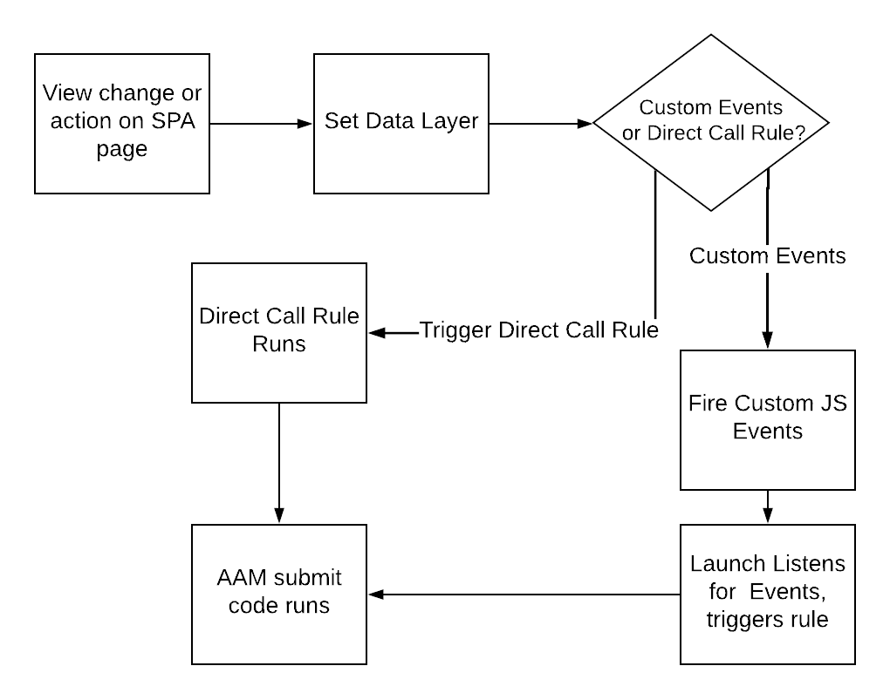

# AAM에 데이터를 보낼 때 SPA 페이지에서 모범 사례를 사용합니다 {#using-best-practices-on-spa-pages-when-sending-data-to-aam}

이 문서에서는 SPA(단일 페이지 애플리케이션)에서 Adobe Audience Manager(AAM)으로 데이터를 전송하는 몇 가지 우수 사례에 대해 설명합니다. 이 문서는 사용에 중점을 둡니다 [!UICONTROL Experience Platform tags]를 설정하는 것이 좋습니다.

## 초기 노트

* 아래 항목에서는 플랫폼 태그를 사용하여 사이트에서 구현한다고 가정합니다. 플랫폼 태그를 사용하지 않는 경우에도 고려 사항이 계속 있지만 구현 방법에 맞게 조정해야 합니다.
* 모든 SPA이 다르므로 요구 사항을 가장 잘 충족하기 위해 다음 항목 중 일부를 조정해야 할 수 있지만, Adobe은 SPA 페이지에서 Audience Manager으로 데이터를 보낼 때 고려해야 하는 몇 가지 우수 사례를 공유하려고 합니다.

## Experience Platform 태그에서 SPA 및 AAM 작업(이전의 Launch)의 간단한 다이어그램{#simple-diagram-of-working-with-spas-and-aam-in-experience-platform-launch}

>[!NOTE]
>앞에서 설명한 대로, 플랫폼 태그를 사용하여 Adobe Audience Manager 구현(Adobe Analytics 없음)에서 SPA 페이지를 처리하는 방법을 보여주는 간소화된 다이어그램입니다. 보시다시피 이는 매우 간단합니다. 이제 Platform 태그에 보기 변경(또는 작업)을 전달하는 방법을 결정하는 것이 중요한 결정입니다.

## SPA 페이지에서 태그 트리거 {#triggering-launch-from-the-spa-page}

플랫폼 태그에서 규칙을 트리거하는 일반적인 방법 중 두 가지는 다음과 같습니다. 따라서 데이터를 Audience Manager으로 보냅니다.

* JavaScript 사용자 지정 이벤트 설정(예 참조) [여기](https://helpx.adobe.com/analytics/kt/using/spa-analytics-best-practices-feature-video-use.html) Adobe Analytics 사용)
* 사용 [!UICONTROL Direct Call Rule]

이 Audience Manager 예제에서는 [!UICONTROL Direct Call rule] 플랫폼 태그에서 히트가 Audience Manager으로 이동하는 것을 트리거합니다. 다음 섹션에서 볼 수 있듯이 이 기능은 [!UICONTROL Data Layer] 를 클릭하여 제품에서 사용할 수 있도록 [!UICONTROL Data Element] 플랫폼 태그.

## 데모 페이지 {#demo-page}

다음은 SPA 페이지에서 하듯이 데이터 레이어에서 값을 변경하여 Audience Manager으로 전송하는 방법을 보여 주는 작은 페이지입니다. 이 기능은 필요한 보다 정교한 변경을 위해 모델링할 수 있습니다. 이 데모 페이지를 찾을 수 있습니다 [여기](https://aam.enablementadobe.com/SPA-Launch.html).

## 데이터 레이어 설정 {#setting-the-data-layer}

언급했듯이 페이지에 새 컨텐츠가 로드되거나 사이트에서 작업을 수행하는 경우 PLATFORM 태그가 호출되고 를 실행하기 전에 페이지 헤드에서 데이터 레이어를 동적으로 설정해야 합니다 [!UICONTROL rules]: 플랫폼 태그가 데이터 계층에서 새 값을 선택하고 Audience Manager에 푸시할 수 있도록 합니다.

위에 나열된 데모 사이트로 이동하여 페이지 소스를 확인하면 다음이 표시됩니다.

* 데이터 계층은 플랫폼 태그를 호출하기 전에 페이지의 헤드에 있습니다
* 시뮬레이션된 SPA 링크의 JavaScript가 [!UICONTROL Data Layer]를 호출한 다음 플랫폼 태그( `_satellite.track()` 호출). 이 이벤트 대신 JavaScript 사용자 지정 이벤트를 사용하는 경우 [!UICONTROL Direct Call Rule]하지만 단원은 같다. 먼저 [!DNL data layer], 그런 다음 플랫폼 태그를 호출합니다.

>[!VIDEO](https://video.tv.adobe.com/v/23322/?quality=12)

## 추가 리소스 {#additional-resources}

* [Adobe 포럼에 대한 SPA 토론](https://forums.adobe.com/thread/2451022)
* [플랫폼 태그에서 SPA을 구현하는 방법을 보여주는 참조 아키텍처 사이트](https://helpx.adobe.com/experience-manager/kt/integration/using/launch-reference-architecture-SPA-tutorial-implement.html)
* [Adobe Analytics에서 SPA을 추적할 때 모범 사례 사용](https://helpx.adobe.com/analytics/kt/using/spa-analytics-best-practices-feature-video-use.html)
* [이 문서에 사용된 데모 사이트](https://aam.enablementadobe.com/SPA-Launch.html)
